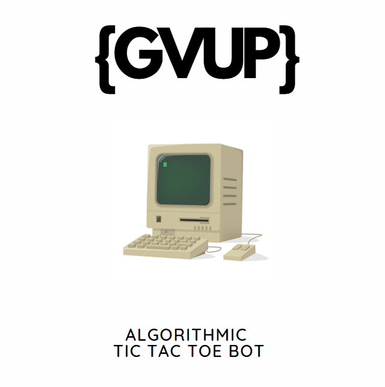

<!-- Improved compatibility of back to top link: See: https://github.com/othneildrew/Best-README-Template/pull/73 -->
<a id="readme-top"></a>

<!-- PROJECT SHIELDS -->
[![Contributors][contributors-shield]][contributors-url]
[![Forks][forks-shield]][forks-url]
[![Stargazers][stars-shield]][stars-url]
[![Issues][issues-shield]][issues-url]  
[![LinkedIn][linkedin-shield]][linkedin-url]

[contributors-shield]: https://img.shields.io/github/contributors/KushalPraja/TicTacToeJS?style=flat-square
[forks-shield]: https://img.shields.io/github/forks/KushalPraja/TicTacToeJS?style=flat-square
[stars-shield]: https://img.shields.io/github/stars/KushalPraja/TicTacToeJS?style=flat-square
[issues-shield]: https://img.shields.io/github/issues/KushalPraja/TicTacToeJS?style=flat-square
[linkedin-shield]: https://img.shields.io/badge/LinkedIn-Profile-blue?style=flat-square

[contributors-url]: https://github.com/KushalPraja/TicTacToeJS/graphs/contributors
[forks-url]: https://github.com/KushalPraja/TicTacToeJS/network/members
[stars-url]: https://github.com/KushalPraja/TicTacToeJS/stargazers
[issues-url]: https://github.com/KushalPraja/TicTacToeJS/issues
[linkedin-url]: https://www.linkedin.com/in/kushal-prajapati-988a88252/

<!-- PROJECT LOGO -->
<br />
<div align="center">
  <a href="https://github.com/kushalpraja/TicTacToeJS">
    
  </a>

<h3 align="center">Tic-Tac-Toe AI 🎮🤖</h3>

  <p align="center">
    A simple Tic-Tac-Toe game with an AI that uses Minimax algorithm with Alpha-Beta pruning.
    <br />
    <a href="https://github.com/kushalpraja/TicTacToeJS"><strong>Explore the repo »</strong></a>
    <br />
    <br />
    <a href="https://kushalpraja.github.io/TicTacToeJS/">View Demo</a>
    &middot;
    <a href="https://github.com/kushalpraja/TicTacToeJS/issues/new?labels=bug&template=bug-report---.md">Report Bug</a>
    &middot;
    <a href="https://github.com/kushalpraja/TicTacToeJS/issues/new?labels=enhancement&template=feature-request---.md">Request Feature</a>
  </p>
</div>


## Live Demo 🌐

You can try out the game directly by visiting the live demo:

[Play Tic-Tac-Toe AI Demo](https://kushalpraja.github.io/TicTacToeJS/)

Enjoy battling the CPU and see if you can outsmart the AI! 🎮🤖 

<p align="right">(<a href="#readme-top">back to top</a>)</p>

<!-- TABLE OF CONTENTS -->
<!-- TABLE OF CONTENTS -->
<details>
  <summary>Table of Contents</summary>
  <ol>
    <li>
      <a href="#about-the-project">About The Project</a>
      <ul>
        <li><a href="#built-with">Built With</a></li>
        <li><a href="#ai-overview">AI Overview</a></li>
        <li><a href="#how-the-bot-makes-moves">How the Bot Makes Moves</a></li>
      </ul>
    </li>
    <li>
      <a href="#getting-started-">Getting Started</a>
      <ul>
        <li><a href="#prerequisites">Prerequisites</a></li>
        <li><a href="#installation">Installation</a></li>
      </ul>
    </li>
    <li><a href="#usage">Usage</a></li>
    <li><a href="#roadmap">Roadmap</a></li>
    <li><a href="#what-i-learned">What I Learned</a></li>
    <li><a href="#future-improvements">Future Improvements</a></li>
    <li><a href="#contributing">Contributing</a></li>
    <li><a href="#license">License</a></li>
    <li><a href="#contact">Contact</a></li>
    <li><a href="#credits">Credits</a></li>
  </ol>
</details>


<!-- ABOUT THE PROJECT -->
## About The Project

Tic-Tac-Toe AI is a web-based game where you can play **Tic-Tac-Toe** against another player or an AI bot. The AI uses the **Minimax algorithm** with **Alpha-Beta pruning** to make optimal moves. The game is built with HTML, CSS, and JavaScript and offers an interactive UI with dynamic rendering for player moves.

### Built With

* [JavaScript](https://www.javascript.com/)
* [HTML5](https://html.spec.whatwg.org/)
* [CSS3](https://www.w3.org/Style/CSS/Overview.en.html)

<p align="right">(<a href="#readme-top">back to top</a>)</p>

### Features:
- **Two-player mode**: Human vs. Human on the same device.
- **Player vs. Bot mode**: Human vs. Bot (AI-driven).
- **AI Bot**: The bot uses the **Minimax algorithm** with **Alpha-Beta pruning** for optimal decision-making.
- **Interactive UI**: Simple and clean interface with a dialog to select the opponent.

---

## AI Overview

The AI in this project uses the **Minimax Algorithm** with **Alpha-Beta Pruning** to make decisions. Here’s a breakdown of how the AI works:

### Minimax Algorithm
The **Minimax** algorithm is a decision-making algorithm used in game theory to determine the best possible move. In a zero-sum game like Tic-Tac-Toe, the objective is to maximize the bot's chances of winning while minimizing the player’s chances.

- **Bot (Maximizing)**: The bot tries to maximize its score, attempting to win or at least draw.
- **Player (Minimizing)**: The human player tries to minimize the bot's score, preventing it from winning.

### Alpha-Beta Pruning
**Alpha-Beta Pruning** is an optimization technique for the Minimax algorithm. It helps to cut off branches of the game tree that won't affect the final decision, improving the algorithm’s performance by avoiding unnecessary calculations.

- **Alpha**: The best score that the maximizer (AI) can guarantee.
- **Beta**: The best score that the minimizer (player) can guarantee.

When the algorithm detects that a node cannot affect the outcome of the game, it stops exploring that path, making it more efficient.

---

## How the Bot Makes Moves

1. **Blocking Opponent's Winning Move**: 
   The AI checks if the player is one move away from winning and blocks that move immediately if found.

2. **Finding the Best Move**: 
   After blocking the player's winning move (if necessary), the AI evaluates all possible moves and assigns them a score based on whether they lead to a win, loss, or draw. The AI will prioritize moves that lead to a win and block the player’s winning moves.

3. **Minimax Evaluation**: 
   The AI explores all possible game states recursively, with the Minimax algorithm evaluating each state. The best move is selected based on the game tree's values, with pruning to optimize performance.

---

## Getting Started

This is an example of how you can set up this project locally.

### Prerequisites

* Node.js
* npm

### Installation
---

1. Clone the repo
   ```sh
   git clone https://github.com/KushalPraja/TicTacToeJS.git

2. Navigate to the project directory
    ```
    cd TicTacToeJS
    ```

<p align="right">(<a href="#readme-top">back to top</a>)</p>


## Usage

1. Start the development server.

2. Open your browser and navigate to [http://localhost:3000](http://localhost:3000).

3. You will be prompted to choose whether you want to play against another player or the bot.

4. Enjoy playing!

For more details on how to implement similar AI-driven games or to contribute, refer to the code and AI implementation in the repository.

<p align="right">(<a href="#readme-top">back to top</a>)</p>

## Roadmap

- [ ] Add difficulty levels (Easy, Medium, Hard) for the bot.
- [ ] Implement mobile responsiveness.
- [ ] Add a feature to track the game history.
- [ ] Improve AI decision-making with neural networks.

<p align="right">(<a href="#readme-top">back to top</a>)</p>


## What I Learned

### Minimax Algorithm
- I gained a solid understanding of the Minimax algorithm and its optimization using Alpha-Beta pruning.

### Game Theory 🎲
- The project helped me learn the basics of game theory and decision-making algorithms.

### Dynamic DOM Manipulation 🖥️
- I learned how to dynamically update the HTML DOM based on user actions and game states.

### User Input Management 🖱️
- I also learned how to handle user inputs effectively and manage game states (win, loss, draw).

### Asynchronous Programming ⏳
- I implemented some asynchronous elements like the AI thinking delay, providing a more realistic experience for the player while the bot makes its move.

<p align="right">(<a href="#readme-top">back to top</a>)</p>


## Future Improvements

- Implement Monte Carlo Tree Search (MCTS) for better AI decision-making.
- Improve performance for large-scale AI games beyond Tic-Tac-Toe.
- Explore implementing a neural network to enhance the bot's learning capabilities.

<p align="right">(<a href="#readme-top">back to top</a>)</p>

---

## Contributing

Contributions are what make the open-source community such an amazing place to learn, inspire, and create. Any contributions you make are **greatly appreciated**.

To contribute:

1. Fork the repo.
2. Create your feature branch (`git checkout -b feature/AmazingFeature`).
3. Commit your changes (`git commit -m 'Add some AmazingFeature'`).
4. Push to your branch (`git push origin feature/AmazingFeature`).
5. Open a pull request.

<p align="right">(<a href="#readme-top">back to top</a>)</p>

---

## License

Distributed under the MIT License. See `LICENSE` for more information.

<p align="right">(<a href="#readme-top">back to top</a>)</p>

---

## Contact

Kushal Prajapati - [@kushalpraja](https://github.com/kushalpraja) - kushalpraja6@gmail.com

Project Link: [https://github.com/KushalPraja/TicTacToeJS](https://github.com/KushalPraja/TicTacToeJS)

<p align="right">(<a href="#readme-top">back to top</a>)</p>

---

## Credits

- [othneildrew's Best-README-Template](https://github.com/othneildrew/Best-README-Template)
- [Choose an Open Source License](https://choosealicense.com)
- [GitHub Emoji Cheat Sheet](https://www.webpagefx.com/tools/emoji-cheat-sheet)
- [Malven's Flexbox Cheatsheet](https://flexbox.malven.co/)
- [Geeksforgeeks](https://www.geeksforgeeks.org/javascript-complete-guide/?ref=shm)
- [Img Shields](https://shields.io)

<p align="right">(<a href="#readme-top">back to top</a>)</p>
